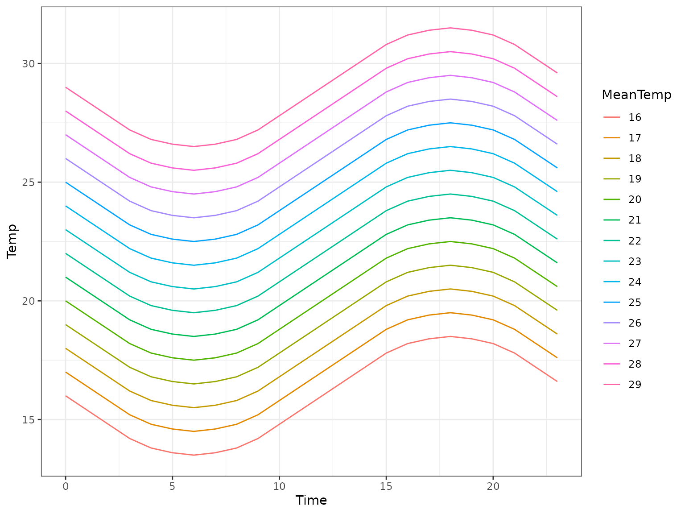
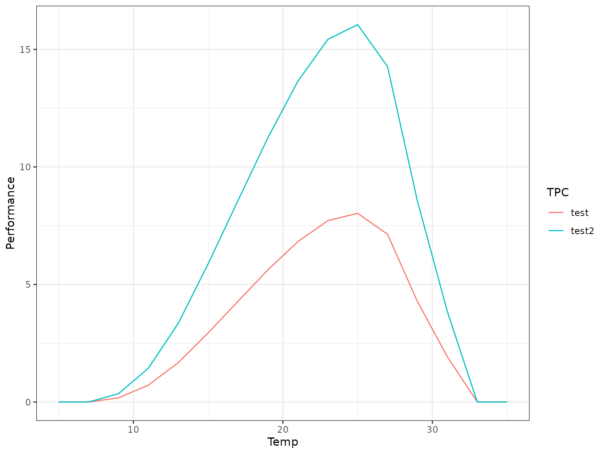
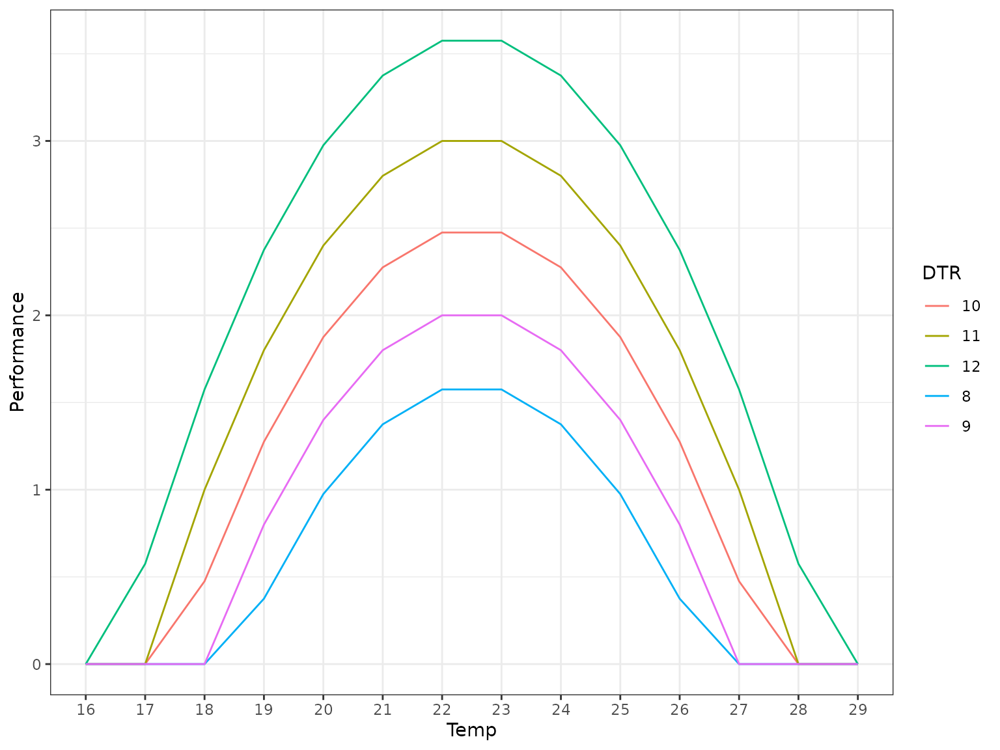
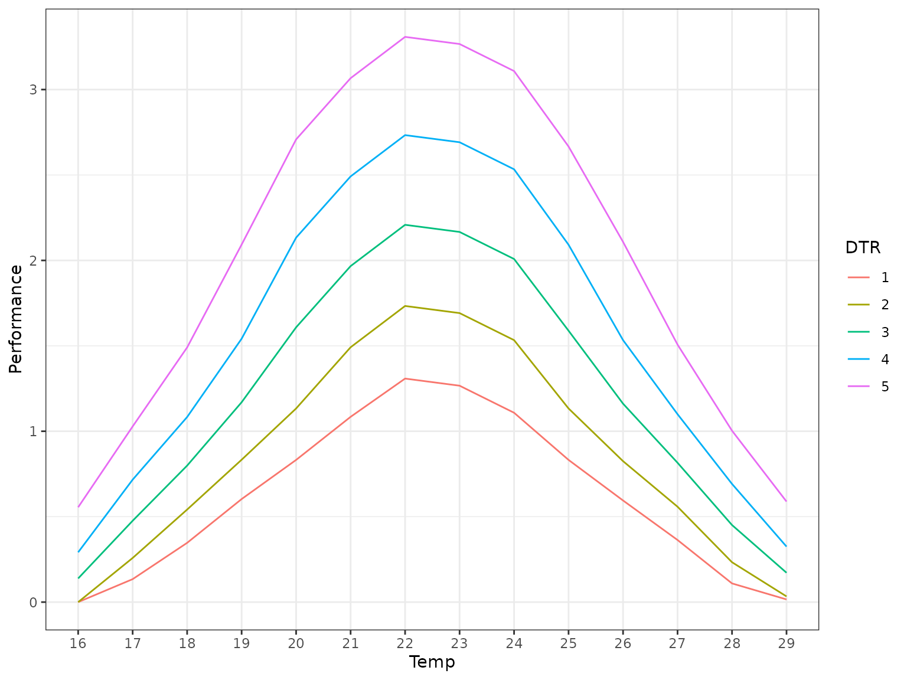

# Performing non-linear averaging on TPCs

## Introduction

Non-linear averaging (aka rate summation) is predicated upon the concept
that the average of a function is not the same as the function of the
average.

$$\overline{f(X)} \neq f\left( \overline{X} \right)$$

This is known as [Jensen’s
inequality](https://en.wikipedia.org/wiki/Jensen%27s_inequality), and is
a powerful concept to aid in understanding results from the natural
world.

In thermal biology, Jensen’s inequality rears its head when considering
fluctuating temperatures.

### Fluctuating temperatures

If you wish to simply test the responses of an organism at a constant
temperature, you can hold them at that temperature and measure their
performance (e.g. growth rate).

That said, temperatures in nature are rarely stationary over the scale
of a day: midday is usually warmer than the dead of night due to radiant
heating from the sun.

Given this, when an organism is nominally at a daily temperature of
20°C, it is actually experiencing a range of temperatures around that
value (say 10°C-30°C).

According to Jensen’s inequality, for a function $f(T)$ that defines
trait performance, taking $f\left( \overline{T} \right)$ is not the same
as $\overline{f(X)}$. As such, researchers commonly use non-linear
averaging (NLA) to calculate $\overline{f(X)}$ instead.

## Averaging curves with functional forms

The simplest scenario for averaging $f$ is when you have a function in r
for $f$ (a good source for these functions is the
[rTPC](https://padpadpadpad.github.io/rTPC/) package).

When you have both the function $f$ and its associated parameterisation
(e.g. from fitting the TPC to a set of data), computing
$\overline{f(T)}$ is trivial.

`nla` provides a method to do this at scale on a batch of tpcs at once,
given a batch of daily temperature curves.

For this example we are going to use the
[`rTPC::briere2_1999()`](https://rdrr.io/pkg/rTPC/man/briere2_1999.html)
TPC function as our base TPC.

### Parameterising the TPC

Usually you would derive the parameters to be used in your TPC function
from fitting the curve, however in this case we have not done that as we
have no data.

[`rTPC::briere2_1999()`](https://rdrr.io/pkg/rTPC/man/briere2_1999.html)
has 5 parameters, none of which have default values:

``` r
formals(rTPC::briere2_1999)
#> $temp
#> 
#> 
#> $tmin
#> 
#> 
#> $tmax
#> 
#> 
#> $a
#> 
#> 
#> $b
```

We will need to provide all of these parameters to the TPC in some way.
This is done in `nla` by providing a *named list* of parameters:

``` r
param_list <- list(
  "a" = c(0.01, 0.02),
  "b" = 2,
  "tmin" = 10,
  "tmax" = 30,
  "labels" = c("test", "test2")
)
```

A few things to note here:

- The `temp` parameter will be filled in by `nla`
- All TPC parameters without defaults must be present in the parameter
  list.
- Normal vector recycling rules apply, so each entry in the list must
  either be a vector of the same length, or a single value (which will
  be used for each TPC run).
- The `labels` entry in the list allows your to label the output rows.
  This is not required but can be useful.

### Generating the daily temperature curve

Alongside the TPC, we also require a daily temperature curve (or set of
curves) to define the fluctuating temperatures we wish to account for.

`nla` provides a set of functions for generating these curves, which all
start with `dt_`. For this example let’s use a simple sine wave at
various mean temperatures:

``` r
library(nla)
```

``` r
dailytemps <- dt_sin(dtr = 5, tbar = seq(5,35, 2), sunrise = 6, resolution = 1, clamp = TRUE)
dailytemps
#>      5   7    9   11   13   15   17   19   21   23   25   27   29   31   33
#> 6  5.0 5.0  6.5  8.5 10.5 12.5 14.5 16.5 18.5 20.5 22.5 24.5 26.5 28.5 30.5
#> 7  5.0 5.0  6.6  8.6 10.6 12.6 14.6 16.6 18.6 20.6 22.6 24.6 26.6 28.6 30.6
#> 8  5.0 5.0  6.8  8.8 10.8 12.8 14.8 16.8 18.8 20.8 22.8 24.8 26.8 28.8 30.8
#> 9  5.0 5.2  7.2  9.2 11.2 13.2 15.2 17.2 19.2 21.2 23.2 25.2 27.2 29.2 31.2
#> 10 5.0 5.8  7.8  9.8 11.8 13.8 15.8 17.8 19.8 21.8 23.8 25.8 27.8 29.8 31.8
#> 11 5.0 6.4  8.4 10.4 12.4 14.4 16.4 18.4 20.4 22.4 24.4 26.4 28.4 30.4 32.4
#> 12 5.0 7.0  9.0 11.0 13.0 15.0 17.0 19.0 21.0 23.0 25.0 27.0 29.0 31.0 33.0
#> 13 5.6 7.6  9.6 11.6 13.6 15.6 17.6 19.6 21.6 23.6 25.6 27.6 29.6 31.6 33.6
#> 14 6.2 8.2 10.2 12.2 14.2 16.2 18.2 20.2 22.2 24.2 26.2 28.2 30.2 32.2 34.2
#> 15 6.8 8.8 10.8 12.8 14.8 16.8 18.8 20.8 22.8 24.8 26.8 28.8 30.8 32.8 34.8
#> 16 7.2 9.2 11.2 13.2 15.2 17.2 19.2 21.2 23.2 25.2 27.2 29.2 31.2 33.2 35.0
#> 17 7.4 9.4 11.4 13.4 15.4 17.4 19.4 21.4 23.4 25.4 27.4 29.4 31.4 33.4 35.0
#> 18 7.5 9.5 11.5 13.5 15.5 17.5 19.5 21.5 23.5 25.5 27.5 29.5 31.5 33.5 35.0
#> 19 7.4 9.4 11.4 13.4 15.4 17.4 19.4 21.4 23.4 25.4 27.4 29.4 31.4 33.4 35.0
#> 20 7.2 9.2 11.2 13.2 15.2 17.2 19.2 21.2 23.2 25.2 27.2 29.2 31.2 33.2 35.0
#> 21 6.8 8.8 10.8 12.8 14.8 16.8 18.8 20.8 22.8 24.8 26.8 28.8 30.8 32.8 34.8
#> 22 6.2 8.2 10.2 12.2 14.2 16.2 18.2 20.2 22.2 24.2 26.2 28.2 30.2 32.2 34.2
#> 23 5.6 7.6  9.6 11.6 13.6 15.6 17.6 19.6 21.6 23.6 25.6 27.6 29.6 31.6 33.6
#> 0  5.0 7.0  9.0 11.0 13.0 15.0 17.0 19.0 21.0 23.0 25.0 27.0 29.0 31.0 33.0
#> 1  5.0 6.4  8.4 10.4 12.4 14.4 16.4 18.4 20.4 22.4 24.4 26.4 28.4 30.4 32.4
#> 2  5.0 5.8  7.8  9.8 11.8 13.8 15.8 17.8 19.8 21.8 23.8 25.8 27.8 29.8 31.8
#> 3  5.0 5.2  7.2  9.2 11.2 13.2 15.2 17.2 19.2 21.2 23.2 25.2 27.2 29.2 31.2
#> 4  5.0 5.0  6.8  8.8 10.8 12.8 14.8 16.8 18.8 20.8 22.8 24.8 26.8 28.8 30.8
#> 5  5.0 5.0  6.6  8.6 10.6 12.6 14.6 16.6 18.6 20.6 22.6 24.6 26.6 28.6 30.6
#>      35
#> 6  32.5
#> 7  32.6
#> 8  32.8
#> 9  33.2
#> 10 33.8
#> 11 34.4
#> 12 35.0
#> 13 35.0
#> 14 35.0
#> 15 35.0
#> 16 35.0
#> 17 35.0
#> 18 35.0
#> 19 35.0
#> 20 35.0
#> 21 35.0
#> 22 35.0
#> 23 35.0
#> 0  35.0
#> 1  34.4
#> 2  33.8
#> 3  33.2
#> 4  32.8
#> 5  32.6
```



*If you look closely you’ll notice that the numbers don’t quite match up
here, this is because the above graph is generated with `clamp = FALSE`
to show the full daily temperature curve.*

### Actually performing the averaging

Finally, to actually perform the NLA, we will use the
[`nla_tpc_analytic()`](https://fwimp.github.io/nla/reference/nla_tpc_analytic.md)
function. This performs the NLA process for each timepoint in the tpc
(as defined by the input temperatures, the columns in
`dailytemperatures`).

``` r
tpcs_nla_analytic <- nla_tpc_analytic(rTPC::briere2_1999, param_list, dailytemps, minvalue = 0, default_value = 0)
tpcs_nla_analytic
#>       5 7         9        11       13       15       17        19        21
#> test  0 0 0.1759499 0.7188155 1.673702 2.939497 4.288498  5.623414  6.820992
#> test2 0 0 0.3518997 1.4376311 3.347403 5.878995 8.576997 11.246827 13.641983
#>              23        25        27       29       31 33 35
#> test   7.711899  8.026485  7.133447 4.270292 1.925617  0  0
#> test2 15.423799 16.052970 14.266895 8.540583 3.851234  0  0
```



## Averaging empirically-derived curves

Performing NLA on empirically-derived thermal performance curves (curves
of $f(T)$ against $T$) is an extra challenge, as you do not necessarily
have a functional form of $f$.

`nla` aims to help with this problem using the
[`nla_tpc_empirical()`](https://fwimp.github.io/nla/reference/nla_tpc_empirical.md)
function.

### Generating our data

Before we go through how to perform NLA on “empirical” data, let’s
generate some pseudo-data to work with.

``` r
# Our test tpc function, you would not usually have this for empirical data
test_tpcfunc <- function(temp, tmin, tmax, a) {
    -1 * a * (temp - tmin) * (temp - tmax) * (tmax > temp) * (tmin < temp)
}

# Generate a sequence of temperatures and t_breadths
tbar <- 16:29
t_breadth <- 8:12 # Could make finer later

fitlist <- lapply(t_breadth,
      \(tb, temp, tmean, a) {
            test_tpcfunc(temp, tmean - (tb/2), tmean + (tb/2), a)
        }, 
      temp = tbar,
      tmean = 22.5,
      a = 0.1)

tpc_mat <- t(matrix(unlist(fitlist), ncol = length(t_breadth)))
rownames(tpc_mat) <- t_breadth
colnames(tpc_mat) <- tbar
tpc_mat
#>    16    17    18    19    20    21    22    23    24    25    26    27    28
#> 8   0 0.000 0.000 0.375 0.975 1.375 1.575 1.575 1.375 0.975 0.375 0.000 0.000
#> 9   0 0.000 0.000 0.800 1.400 1.800 2.000 2.000 1.800 1.400 0.800 0.000 0.000
#> 10  0 0.000 0.475 1.275 1.875 2.275 2.475 2.475 2.275 1.875 1.275 0.475 0.000
#> 11  0 0.000 1.000 1.800 2.400 2.800 3.000 3.000 2.800 2.400 1.800 1.000 0.000
#> 12  0 0.575 1.575 2.375 2.975 3.375 3.575 3.575 3.375 2.975 2.375 1.575 0.575
#>    29
#> 8   0
#> 9   0
#> 10  0
#> 11  0
#> 12  0
```

This is a set of 5 TPCs between 15°C and 30°C.

Of course, in reality you would probably have generated these data



Let’s generate a slightly different daily temperature matrix this time.

``` r
dailytemps_2 <- dt_sin(dtr = 5, tbar = seq(16,29, 1), sunrise = 6, resolution = 1, clamp = TRUE)
dailytemps_2
#>      16   17   18   19   20   21   22   23   24   25   26   27   28   29
#> 6  16.0 16.0 16.0 16.5 17.5 18.5 19.5 20.5 21.5 22.5 23.5 24.5 25.5 26.5
#> 7  16.0 16.0 16.0 16.6 17.6 18.6 19.6 20.6 21.6 22.6 23.6 24.6 25.6 26.6
#> 8  16.0 16.0 16.0 16.8 17.8 18.8 19.8 20.8 21.8 22.8 23.8 24.8 25.8 26.8
#> 9  16.0 16.0 16.2 17.2 18.2 19.2 20.2 21.2 22.2 23.2 24.2 25.2 26.2 27.2
#> 10 16.0 16.0 16.8 17.8 18.8 19.8 20.8 21.8 22.8 23.8 24.8 25.8 26.8 27.8
#> 11 16.0 16.4 17.4 18.4 19.4 20.4 21.4 22.4 23.4 24.4 25.4 26.4 27.4 28.4
#> 12 16.0 17.0 18.0 19.0 20.0 21.0 22.0 23.0 24.0 25.0 26.0 27.0 28.0 29.0
#> 13 16.6 17.6 18.6 19.6 20.6 21.6 22.6 23.6 24.6 25.6 26.6 27.6 28.6 29.0
#> 14 17.2 18.2 19.2 20.2 21.2 22.2 23.2 24.2 25.2 26.2 27.2 28.2 29.0 29.0
#> 15 17.8 18.8 19.8 20.8 21.8 22.8 23.8 24.8 25.8 26.8 27.8 28.8 29.0 29.0
#> 16 18.2 19.2 20.2 21.2 22.2 23.2 24.2 25.2 26.2 27.2 28.2 29.0 29.0 29.0
#> 17 18.4 19.4 20.4 21.4 22.4 23.4 24.4 25.4 26.4 27.4 28.4 29.0 29.0 29.0
#> 18 18.5 19.5 20.5 21.5 22.5 23.5 24.5 25.5 26.5 27.5 28.5 29.0 29.0 29.0
#> 19 18.4 19.4 20.4 21.4 22.4 23.4 24.4 25.4 26.4 27.4 28.4 29.0 29.0 29.0
#> 20 18.2 19.2 20.2 21.2 22.2 23.2 24.2 25.2 26.2 27.2 28.2 29.0 29.0 29.0
#> 21 17.8 18.8 19.8 20.8 21.8 22.8 23.8 24.8 25.8 26.8 27.8 28.8 29.0 29.0
#> 22 17.2 18.2 19.2 20.2 21.2 22.2 23.2 24.2 25.2 26.2 27.2 28.2 29.0 29.0
#> 23 16.6 17.6 18.6 19.6 20.6 21.6 22.6 23.6 24.6 25.6 26.6 27.6 28.6 29.0
#> 0  16.0 17.0 18.0 19.0 20.0 21.0 22.0 23.0 24.0 25.0 26.0 27.0 28.0 29.0
#> 1  16.0 16.4 17.4 18.4 19.4 20.4 21.4 22.4 23.4 24.4 25.4 26.4 27.4 28.4
#> 2  16.0 16.0 16.8 17.8 18.8 19.8 20.8 21.8 22.8 23.8 24.8 25.8 26.8 27.8
#> 3  16.0 16.0 16.2 17.2 18.2 19.2 20.2 21.2 22.2 23.2 24.2 25.2 26.2 27.2
#> 4  16.0 16.0 16.0 16.8 17.8 18.8 19.8 20.8 21.8 22.8 23.8 24.8 25.8 26.8
#> 5  16.0 16.0 16.0 16.6 17.6 18.6 19.6 20.6 21.6 22.6 23.6 24.6 25.6 26.6
```

Finally we can apply NLA to the “empirical” data.

``` r
tpcs_nla_empirical <- nla_tpc_empirical(tpc_mat, dailytemps_2)
tpcs_nla_empirical
#>             16        17        18        19        20       21       22
#> [1,] 0.0000000 0.1343750 0.3468750 0.6031250 0.8322917 1.084375 1.308333
#> [2,] 0.0000000 0.2583333 0.5416667 0.8333333 1.1333333 1.491667 1.733333
#> [3,] 0.1385417 0.4760417 0.7989583 1.1697917 1.6083333 1.966667 2.208333
#> [4,] 0.2916667 0.7166667 1.0833333 1.5416667 2.1333333 2.491667 2.733333
#> [5,] 0.5552083 1.0281250 1.4906250 2.0927083 2.7083333 3.066667 3.308333
#>            23       24        25        26        27        28         29
#> [1,] 1.266667 1.108333 0.8322917 0.5947917 0.3635417 0.1093750 0.01562500
#> [2,] 1.691667 1.533333 1.1333333 0.8250000 0.5583333 0.2333333 0.03333333
#> [3,] 2.166667 2.008333 1.5885417 1.1614583 0.8156250 0.4510417 0.17187500
#> [4,] 2.691667 2.533333 2.0916667 1.5333333 1.1000000 0.6916667 0.32500000
#> [5,] 3.266667 3.108333 2.6666667 2.1083333 1.5072917 1.0031250 0.58854167
```


